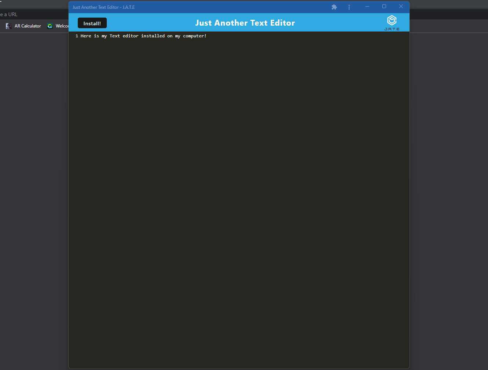

# Text Editor PWA 
  
## Description

This is a application that allows the user to write text in their browser or through a downloaded application.

## Table of Contents

- [Installation](#installation)
- [Usage](#usage)
- [License](#license)
- [Contributing](#contributing)
- [Tests](#tests)
- [Questions](#questions)

## Installation

run npm i, then run npm start:dev

## Usage

Click install to install to your desktop

## License

This project is not licensed.

## Contributing

I collaborated with Nick Rosales.  his github is https://github.com/NickRosales

## Tests

There are no tests for this project.

## Questions

Github username: [Mpacct](https://www.github.com/Mpacct)

Email: marcuspacc@gmail.com

